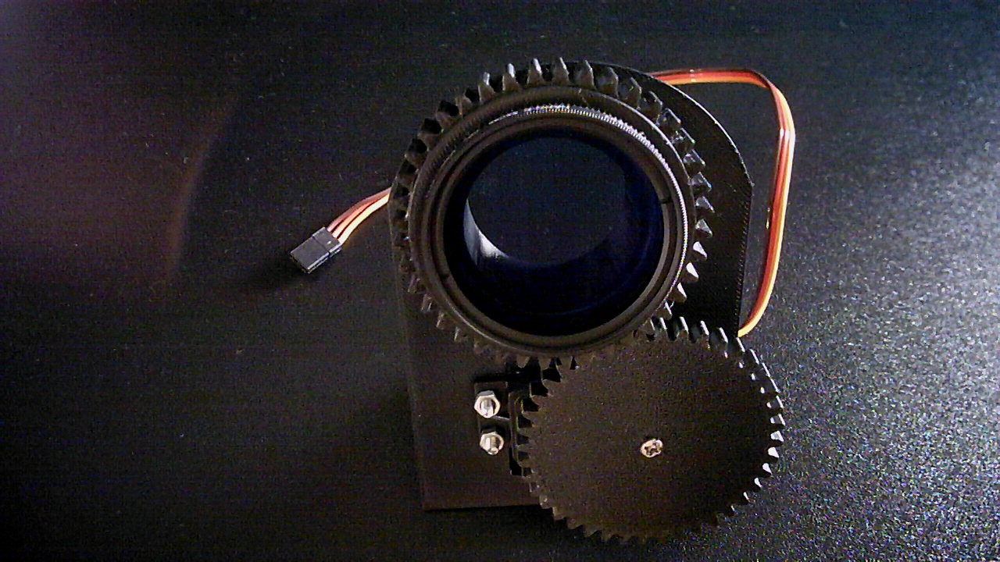

**Proof of concept:**
This first proof of concept is focused on a mechanical rotating filter.

**Version 1:**

* Actuator: Servo
* Link: Gears (designed using on-Shape's built in tool)
* No camera fixing location

**Components**
* Polarization filter : K&F KF01.1432
* Servo: Feetech FT5330M
* Bearing:  6807RS
